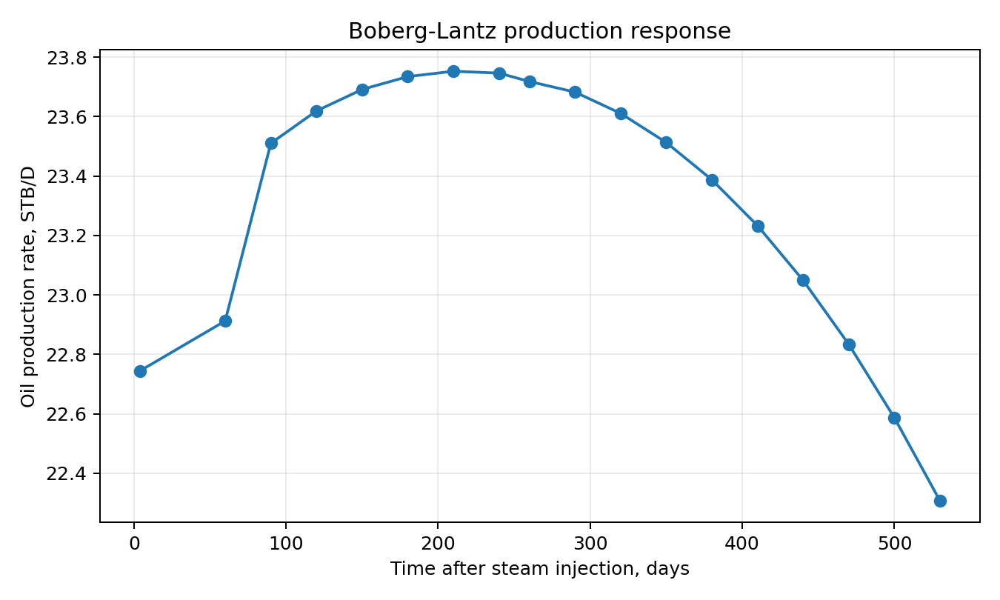
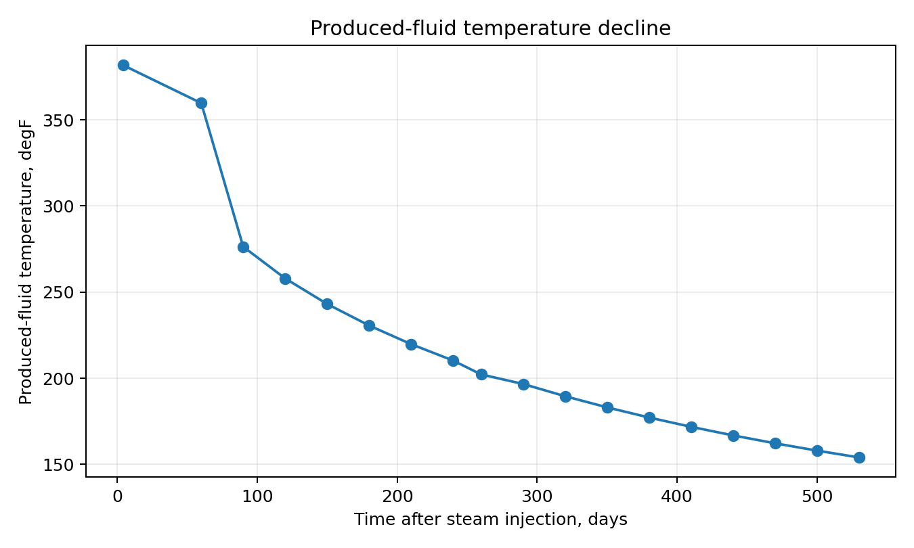
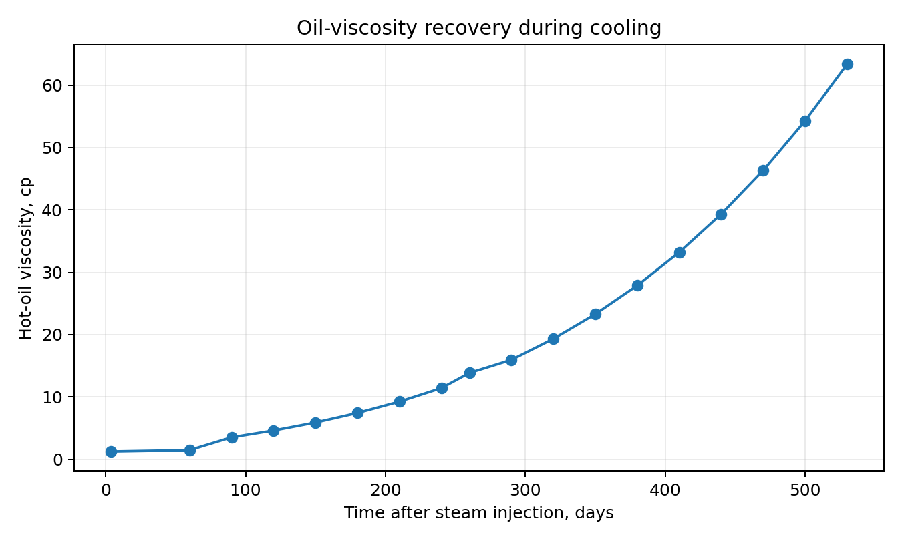
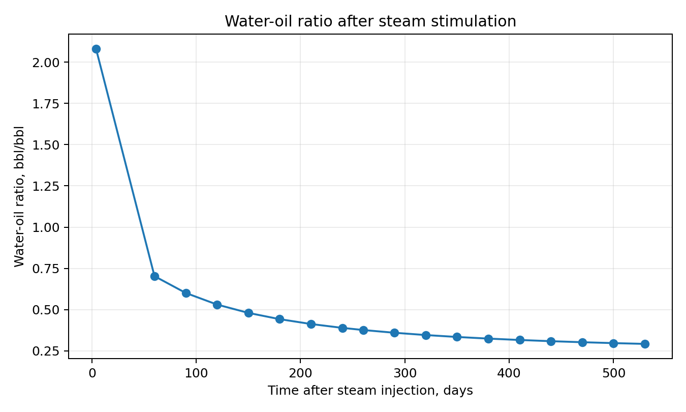

# Boberg-Lantz Steam Stimulation Model in Python

A reproducible Python implementation of the **Boberg-Lantz cyclic steam
stimulation model** for estimating the post-steam production response of
a heavy-oil well.

The project implements the thermal and production calculations used in
**Example 8.6** of Green and Willhite, *Enhanced Oil Recovery*, Second
Edition, while keeping the temperature response computational rather
than hard-coding the values from the published table.

## What the model calculates

The workflow combines:

- steam heat input and Marx-Langenheim heated-zone estimation;
- equivalent heated radius and incremental heated thickness;
- radial and vertical transient cooling;
- temperature-dependent oil density and viscosity;
- hot/cold productivity-index ratio;
- surface and reservoir-volume oil rates;
- heat removal with produced oil and water;
- post-stimulation water-oil ratio;
- cumulative oil and water production.

## Example output

### Oil production response



### Produced-fluid temperature



### Oil viscosity during cooling



### Water-oil ratio



## Validation

The implementation is checked against selected values from the published
worked calculation.

| Quantity | Published value | Python result |
|---|---:|---:|
| Steam heat, \(H_s\) | 884.7 Btu/lbm | ~884.71 Btu/lbm |
| Heated radius, \(r_h\) | 51.2 ft | ~51.21 ft |
| Hot-oil viscosity, first interval | 1.22 cp | ~1.23 cp |
| Surface oil rate, first interval | 22.75 STB/D | ~22.74 STB/D |
| Reservoir oil rate, first interval | 25.71 RB/D | ~25.71 RB/D |
| Heat-removal fraction, first interval | 0.038 | ~0.038 |

Automated checks for these values are included under `tests/`.

### Why the later rows do not exactly reproduce the printed table

The published worked example obtains radial dimensionless-temperature
values from the Boberg-Lantz graphical solution. This implementation
calculates \(T_{Dr}\) with the analytical approximation implemented in
`calculate_TDr()` instead of storing the book's table as an input.

This is intentional: the repository demonstrates an executable model,
not a table lookup. Small differences in the later temperature,
viscosity, and rate trajectory should therefore be expected.

See [MODEL_NOTES.md](MODEL_NOTES.md) for the equations and numerical
workflow.

## Repository structure

```text
boberg-lantz-steam-stimulation/
├── README.md
├── MODEL_NOTES.md
├── requirements.txt
├── src/
│   └── boberg_lantz.py
├── examples/
│   └── example_8_6.py
├── tests/
│   └── test_example_8_6.py
├── validation/
│   └── selected_benchmarks.csv
└── results/
    ├── example_8_6_results.csv
    ├── production_rate.png
    ├── produced_temperature.png
    ├── oil_viscosity.png
    └── water_oil_ratio.png
```

## Installation

Clone the repository and install the dependencies:

```bash
git clone <repository-url>
cd boberg-lantz-steam-stimulation
python -m venv .venv
```

On Windows:

```bash
.venv\Scripts\activate
```

On Linux/macOS:

```bash
source .venv/bin/activate
```

Then install:

```bash
pip install -r requirements.txt
```

## Run Example 8.6

From the repository root:

```bash
python examples/example_8_6.py
```

This prints the heated-zone and production calculations and regenerates
the CSV and figures under `results/`.

## Run the tests

```bash
pytest -q
```

## Using the model from Python

```python
import sys
sys.path.insert(0, "src")

from boberg_lantz import ModelInputs, run_model

inputs = ModelInputs(
    h=41.0,
    T_s=381.82,
    T_r=93.0,
    W_is=1000.0,
    t_inj=14.0,
)

results, geometry = run_model(inputs)

print(geometry)
print(results.head())
```

Because the inputs are collected in `ModelInputs`, alternative reservoir
or steam-injection cases can be evaluated without changing the model
implementation.

## Assumptions and limitations

- The model is an engineering implementation of the Boberg-Lantz
  analytical workflow, not a full thermal reservoir simulator.
- Reservoir and fluid behaviour follow the correlations and simplifying
  assumptions used in the worked example.
- The radial dimensionless-temperature calculation uses a truncated
  analytical approximation. Its range and accuracy should be checked
  before extrapolating to substantially different conditions.
- The initial production point follows the worked-example assumption
  \(T_p=T_s\).
- The current implementation uses temperature-dependent oil density in
  the heat-removal calculation.
- Results should be independently checked before engineering design or
  operational use.

## Reference

Green, Don W., and G. Paul Willhite. **Enhanced Oil Recovery. Second
Edition.** Example 8.6, *Estimation of Steam Stimulation Response With
Boberg and Lantz Model*, pp. 538-542.

The book is used as the technical reference and validation benchmark.
No book pages or copyrighted figures are distributed with this
repository.

## Possible extensions

- improve the radial dimensionless-temperature treatment over a wider
  dimensionless-time range;
- add sensitivity studies for steam rate, injection duration, oil
  viscosity, WOR, thickness, and thermal diffusivity;
- calculate incremental oil and oil-steam ratio automatically;
- compare analytical results with a thermal reservoir simulator;
- expose the model through a simple command-line interface or notebook.

## Disclaimer

This repository is intended for technical demonstration, learning, and
model-development purposes. It is not a substitute for project-specific
reservoir characterization, thermal simulation, or engineering review.
